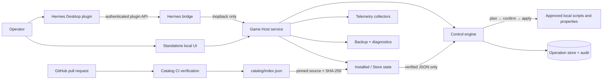

<p align="center">
  
</p>

# Hermes Game Host Console

<p align="center">
  <strong>A guarded control plane for dedicated game servers.</strong><br>
  One console for lifecycle controls, typed configuration, live telemetry, backups, diagnostics, and verified community profiles.
</p>

> [!IMPORTANT]
> This project controls real server processes and files. It binds to loopback by default, requires explicit confirmation for mutations, and does not ship game binaries, publisher credentials, or server tokens.

Hermes Game Host Console turns a folder of dedicated servers into a typed, inspectable operations surface. It runs as a local Python service, appears as a native Hermes Desktop page, and exposes its browser-facing API only through an authenticated Hermes plugin bridge.

The design is deliberately conservative: profiles describe intent, backend adapters define the narrow operations that may occur, and every meaningful mutation passes through **plan → review → confirm → apply**. A control panel should be powerful. It should not be reckless.

## At a glance

| Capability | What it does |
|---|---|
| Native Hermes Desktop UI | Adds the **Game Host** route, sidebar entry, command-palette action, loading/error states, confirmation dialogs, Store, backups, and diagnostics using the Hermes Plugin SDK. |
| Standalone local console | Serves the core UI and API at `http://127.0.0.1:5057`. |
| Two focused examples | Ships Minecraft and Palworld only—enough to demonstrate property-driven, process-aware, telemetry, backup, and lifecycle patterns without pretending every server should be maintained centrally. |
| Typed controls | Closed control kinds: `button`, `switch`, `slider`, `select`, `text`, `number`, and `readonly`. |
| Guarded mutations | One-time plans, actor binding, plan digests, explicit confirmation, per-game serialization, postcondition checks, and audit records. |
| Durable operations | SQLite-backed queued/running/terminal operation states, polling, interrupted-operation recovery, and truthful `outcome_unknown` handling. |
| Live server status | Process and listener probes, readiness blockers, ports, player counts, uptime, and resident memory. |
| Game-aware telemetry | Minecraft ping, Source A2S, Palworld REST, Steam/process probes, and best-effort failure boundaries. |
| Backup and restore | Verified inventories, bounded `.tar.gz` creation, restore preview tokens, stopped-server enforcement, safety backups, and atomic rollback. |
| Diagnostics | Approved log inventory, bounded tails, secret/IP/path redaction, and downloadable diagnostic bundles. |
| Installed/Store model | Shows installed games in the sidebar and keeps the remaining profiles in a dedicated Store. Uninstall keeps server files. |
| Verified GitHub profile catalog | Community packages arrive through pull requests, deterministic CI, strict JSON validation, size limits, SHA-256 verification, and offline fallback. |
| Repository-packaged game art | Local allowlisted WebP artwork with dimensions, digests, provenance, licensing, and graceful fallback—no publisher CDN calls from Desktop. |

## How the system fits together



### Trust boundaries

1. **The browser never chooses a command.** It submits a game ID, control ID, and typed value.
2. **Profiles contain data, not executable code.** Unknown fields, control kinds, actions, and property bindings are rejected.
3. **Community adapters do not choose executable authority.** New IDs are confined to `community/<game-id>` and may only use the fixed local slots `start.sh`, `stop.sh`, and `backup.sh`; no script is downloaded.
4. **Mutations are two-stage.** Planning is read-only; applying requires the same actor, the one-time plan ID, the plan digest, and explicit confirmation.
5. **Remote catalog data is untrusted until proven otherwise.** The service pins the official raw-GitHub path, bounds downloads, validates schemas and semantic bindings, checks exact package size and SHA-256, then stores an atomic verified cache.
6. **Failures close safely.** A bad or unavailable remote catalog never replaces known-good data; the app retains its verified cache or bundled catalog.

## Included examples

| Game | What the example demonstrates | Typical lifecycle contract |
|---|---|---|
| Minecraft Java | Property-backed controls, Minecraft ping, process/listener probes, backup mapping | `start.sh`, `stop.sh`, `backup.sh`, selected `server.properties` keys |
| Palworld | Process/listener probes, authenticated local REST telemetry, player counts, backup source mapping | `start.sh`, `stop.sh`, `backup.sh`, local REST configuration |

Minecraft and Palworld are intentionally the only bundled profiles, adapter configurations, and Store packages. They are reference implementations—not the boundary of what the console can manage.

## Create another server with Hermes

Do not wait for this repository to accumulate a brittle museum of half-maintained game configs. The installer includes the [`hermes-game-host-console`](skills/hermes-game-host-console/SKILL.md) skill so your Hermes Agent can build a profile for the server you actually run.

From this repository, start Hermes and ask plainly:

```text
Use the hermes-game-host-console skill to add a local Valheim dedicated server.
Research the current server requirements from official sources, show me the plan,
and ask before downloading software or starting processes.
```

Hermes will use the shipped examples and schemas to:

1. inspect your projects root and existing server files;
2. research the dedicated server's real ports, process, configuration, and shutdown behavior;
3. create ignored machine-local profiles and adapter configuration;
4. create or adapt narrow lifecycle scripts with your approval;
5. validate the complete registry and restart the console;
6. verify the new entry through the Store, controls, and status APIs.

Local customizations live in `data/local-game-profiles/` and `data/local-game-adapters.json`. Both are ignored by Git so machine paths, credentials, and private server details stay out of the repository. Explicit `GAME_HOST_PROFILES_DIR` and `GAME_HOST_ADAPTER_CONFIG` values still take precedence.

If the profile would benefit others, ask Hermes to prepare a sanitized package and pull request using [CONTRIBUTING.md](CONTRIBUTING.md). The public package remains declarative; server binaries, credentials, and executable scripts stay local.

A profile appearing in the Store does **not** mean its server files are bundled. Installing a profile creates a project home and `PROVISION.md`; you still obtain the dedicated-server files from the game publisher and provide your own local scripts and credentials.

## Control lifecycle

```text
operator input
    ↓
POST /api/control/plan
    ↓
validated typed proposal
    ↓
preview: risk, current → proposed, restart requirement
    ↓
explicit confirmation
    ↓
POST /api/control/apply
    ↓
one-time plan + actor + digest verification
    ↓
serialized operation → approved adapter → postcondition check
    ↓
audit record + rollback material where applicable
```

The operation API records queued, running, succeeded, failed, cancelled, and outcome-unknown states. Desktop polling is abort-aware and stops when the plugin unloads.

## Backups and diagnostics

### Backup flow

- Enumerate only configured backup sources.
- Create a bounded, verified `.tar.gz` artifact.
- Preview a restore without changing files.
- Require the game server to be stopped.
- Require the exact one-time confirmation token from the preview.
- Create a safety backup before restore.
- Roll back atomically if replacement fails.
- Prune according to retention without touching live game files.

### Diagnostic flow

- List only approved game log IDs.
- Tail bounded content instead of streaming unbounded files.
- Redact credentials, authorization values, private paths, control characters, and—by default—IP addresses.
- Build a deterministic diagnostic bundle containing status, blockers, telemetry, operations, and approved log excerpts.
- Fail softly when a process or file disappears during collection.

## Community profile Store

The Store is repository-backed rather than upload-backed. That distinction matters.

```text
contributor package
    → GitHub pull request
    → CODEOWNERS review
    → schema + semantic validation
    → deterministic index rebuild
    → Store/API tests
    → merge to main
    → official catalog feed
    → bounded download + SHA-256 verification
    → local install
    → one Game Host Console restart
    → active profile
```

The repository ships only the Minecraft and Palworld packages. The Store architecture remains open to reviewed community profiles, but the default experience stays deliberately small.

Contributors edit `catalog/packages/<game-id>.json`. GitHub Actions then verifies:

- exact package envelope and allowed JSON fields;
- the existing control-profile and adapter schemas;
- profile ID, adapter ID, and package ID agreement;
- action and mutable-property bindings;
- relative, confined project/script paths;
- package size limits;
- deterministic `catalog/index.json` output;
- exact byte length and SHA-256 digest;
- focused Store loader and API tests;
- absence of stale generated catalog data.

See [CONTRIBUTING.md](CONTRIBUTING.md) for the submission contract, evidence checklist, versioning rules, and explicit prohibition on executable content.

## Install

### Prerequisites

- Linux host
- Python 3.11+
- Hermes Agent/Desktop for the native plugin surface
- Node.js only for JavaScript tests
- Your own legally obtained dedicated-server files

### Clone and run

```bash
git clone https://github.com/Stormxftw/hermes-game-host-console.git
cd hermes-game-host-console
./start.sh
```

Health check:

```bash
curl -fsS http://127.0.0.1:5057/health
```

### Install the Hermes Desktop integration

```bash
./install-hermes-plugin.sh
```

The installer adds the authenticated bridge, Desktop page, local artwork, and the `hermes-game-host-console` skill. Then:

1. Open the Hermes Desktop command palette.
2. Choose **Reload desktop plugins**.
3. Enable **Game Host Console** in Settings → Plugins if it is disabled.
4. Open **Game Host** from the sidebar or command palette.

The visible frontend is a single-file ESM plugin importing only `@hermes/plugin-sdk`, `react`, and `react/jsx-runtime`. The Python plugin is the authenticated backend bridge; it does not render the visible page.

### Uninstall

```bash
./uninstall-hermes-plugin.sh
./stop.sh
```

Uninstalling the console does not delete game-server files or backups.

## Configuration

Common environment variables:

| Variable | Purpose |
|---|---|
| `DASHBOARD_PORT` | Local service port; defaults to `5057`. |
| `HERMES_PROJECTS_ROOT` | Root beneath which relative game project directories are confined. |
| `GAME_HOST_PROFILES_DIR` | Optional machine-local profile directory; `start.sh` uses ignored `data/local-game-profiles/` when present. |
| `GAME_HOST_ADAPTER_CONFIG` | Optional machine-local adapter mapping; `start.sh` uses ignored `data/local-game-adapters.json` when present. |
| `GAME_HOST_STORE_INDEX_URL` | Catalog source override; production code accepts only the approved repository path. |

Use ignored local profile and adapter paths for machine-specific configuration. Public packages should remain portable and relative.

## Development and verification

Focused catalog check:

```bash
uv run --no-project --with jsonschema python3 scripts/build-profile-catalog.py --check
```

Complete Python suite:

```bash
uv run --no-project \
  --with pytest \
  --with fastapi \
  --with jsonschema \
  --with httpx \
  --with pyyaml \
  --with python-multipart \
  python3 -m unittest discover -s tests -v
```

Desktop behavior and contract tests:

```bash
node tests/ui.test.js
node tests/desktop_plugin.test.js
node --test tests/desktop_plugin_behavior.test.mjs
```

Full release gate:

```bash
uv run --no-project \
  --with pytest \
  --with fastapi==0.133.1 \
  --with jsonschema \
  --with httpx \
  --with pyyaml \
  --with python-multipart \
  bash scripts/release-check.sh
```

The release gate checks tracked artifacts, executable bits, generated-data exclusions, Python and Node suites, the Hermes bridge, schemas, catalog reproducibility, plugin installation smoke tests, and a clean Git archive.

## Repository map

```text
app.py                         local HTTP/API service
control_engine.py              schema validation + plan/apply/audit engine
profile_store.py               verified remote catalog, cache, install, activation
operations.py                  durable operation lifecycle
backups.py                     confined backup/restore manager
diagnostics.py                 bounded redacted diagnostic bundles
telemetry.py                   game-aware process/player/uptime/RSS probes
store.py                       installed-game state

game_profiles/                  bundled Minecraft + Palworld examples
game_adapters.json              bundled example adapter mappings
schemas/                        strict JSON Schemas
catalog/packages/               canonical reviewed profile packages
catalog/index.json              deterministic generated catalog
skills/hermes-game-host-console/ Hermes workflow for local server creation

desktop-plugin/plugin.js       native Hermes Desktop page
hermes-plugin/plugin_api.py     authenticated local API bridge
static/                         standalone local web surface
assets/game-art/                allowlisted local game artwork
assets/branding/                project identity artwork

scripts/build-profile-catalog.py deterministic catalog builder
scripts/release-check.sh         release-quality verification gate
tests/                           Python, Node, contract, and security tests
```

## Security posture

- Keep the service on loopback. Do not port-forward `5057`.
- Never commit publisher tokens, admin passwords, server configuration, saves, logs, or diagnostics bundles.
- Treat profile changes as security-sensitive even though they are declarative.
- Require the catalog CI check and maintainer review before merging community packages.
- Keep machine-specific absolute paths in ignored local configuration.
- Review generated diagnostics before sharing them; redaction reduces risk but does not grant infallibility.
- Report vulnerabilities privately to the maintainer rather than opening an issue containing exploit details or secrets.

## Project philosophy

The console is not trying to become a universal shell with prettier buttons. It is a narrow control plane: explicit contracts, visible consequences, recoverable operations, and enough telemetry to tell truth from noise.

The machine may be powerful. The operator should remain in command.

---

<p align="center"><sub>Banner artwork generated for this repository; provenance is documented in <a href="assets/branding/README.md">assets/branding/README.md</a>.</sub></p>
