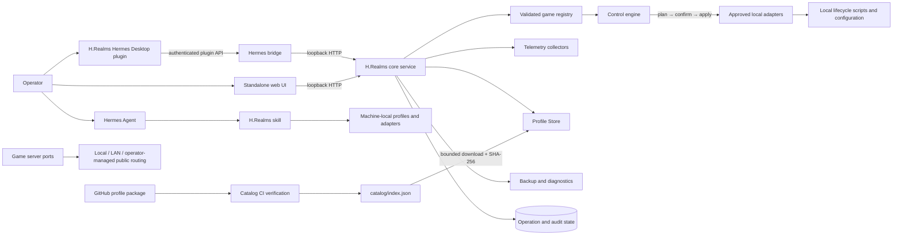

# H.Realms

**Open-source-first, agent-native infrastructure for self-hosted game servers through Hermes.**

H.Realms is a Linux-first control plane for creating, hosting, administering, and extending self-hosted dedicated game servers. It combines a local service, an official H.Realms plugin for Hermes Desktop, a Hermes skill, a standalone web interface, declarative game-server profiles, and a constrained API.

The project is designed to keep the powerful parts narrow and inspectable. Profiles describe what an operator may do, adapters map those approved actions to local scripts, and meaningful changes follow a **plan → review → confirm → apply** workflow.

> [!IMPORTANT]
> H.Realms controls real processes and files. The core service binds to IPv4 loopback, rejects untrusted Host headers, and does not ship game binaries, publisher credentials, server tokens, or executable scripts from the community catalog.

> [!NOTE]
> The repository and several internal identifiers still use the previous name, `hermes-game-host-console`. The product name is now **H.Realms**; internal package, plugin, route, directory, and repository renaming is still in progress.

## A Message from the Developer

I have really enjoyed using Hermes. As a developer who builds things for both work and play, I naturally started thinking about ways I could contribute to the platform.

For the past few months, I have been hosting game servers for Minecraft, Palworld, Valheim, and other games on the same machine that runs Hermes. During that time, I have also been using Hermes as the administrative runner for each server instance.

Then it dawned on me: why not formalize the idea?

Let’s build a dedicated service, a Hermes skill, an official H.Realms plugin for Hermes Desktop, a type-safe API, and a web interface for managing it all.

H.Realms should also provide safe IP routing through playit.gg at no cost while supporting multiple connection methods. Players should be able to connect through a safely masked public address, while trusted users can still connect locally or directly when appropriate.

## Mission

H.Realms aims to make self-hosted game servers easier to deploy, manage, automate, secure, and extend through Hermes.

The long-term goal is not to create a general-purpose remote shell with a game-themed interface. H.Realms is intended to be a focused game-server platform with explicit contracts, visible consequences, recoverable operations, honest status reporting, and safe extension points for both developers and agents.

## Current Project Status

**Status: working MVP / pre-release**

| Area | Status | Notes |
|---|---|---|
| H.Realms core service | Implemented | Local Python HTTP service with catalog, status, operations, backups, diagnostics, and control endpoints. |
| Hermes Desktop plugin | Implemented | Native page, sidebar entry, command-palette action, Store, controls, backups, diagnostics, and confirmation dialogs. |
| Hermes skill | Implemented | Creates and validates machine-local profiles and adapters with explicit approval before downloads or process changes. |
| Standalone web UI | Implemented, partial parity | Core status, Store, and control workflows are available; backup and diagnostics workflows are currently Desktop-first. |
| Declarative profiles and adapters | Implemented | Strict JSON Schemas and runtime validation define supported controls, actions, paths, ports, and collectors. |
| Lifecycle operations | Implemented | Start, stop, restart, configuration changes, serialized execution, postcondition checks, and durable operation history. |
| Backup and restore | Implemented | Verified archives, restore preview, stopped-server enforcement, safety backups, confirmation tokens, and rollback. |
| Diagnostics | Implemented | Approved log inventory, bounded redacted tails, and diagnostic bundles. |
| Verified profile Store | Implemented with deployment limitation | Verification, caching, package installation, and fallback exist. The repository is currently private, so the public raw-GitHub feed and external contribution workflow are not yet publicly usable. |
| Typed API contracts | Implemented | JSON Schema validation, constrained request shapes, typed control values, and JSDoc models are present. |
| Published type-safe SDK | Planned | There is not yet a separately versioned or generated client SDK package. |
| Local and LAN connection reporting | Implemented | The service reports loopback and discovered/configured private LAN game endpoints. |
| playit.gg compatibility | Supported externally | An independently configured playit agent can route game traffic without exposing the H.Realms control service. |
| Built-in playit.gg management | Not verified in tracked `main` | The current repository does not provision, discover, or monitor playit tunnels, and public endpoint telemetry currently remains unset. |
| Public open-source release | In progress | The repository is private and does not yet contain a root `LICENSE` file. |

## Core Capabilities

| Capability | What it provides |
|---|---|
| Declarative server controls | Closed control kinds: `button`, `switch`, `slider`, `select`, `text`, `number`, and `readonly`. |
| Guarded mutations | One-time plans, actor binding, plan digests, explicit confirmation, per-game serialization, postcondition checks, and audit records. |
| Durable operations | SQLite-backed `queued`, `running`, `succeeded`, `failed`, `cancelled`, and `outcome_unknown` states. |
| Honest server status | Independent process, listener, readiness, and protocol-query evidence rather than a single optimistic online flag. |
| Game-aware telemetry | Minecraft server-list ping, Steam/Source A2S, Palworld REST, process state, player counts, uptime, and resident memory. |
| Installed/Store model | Installed games appear in navigation; available profiles remain in the Store. Uninstalling a profile does not delete server files. |
| Backup and recovery | Confined backup sources, verified `.tar.gz` files, restore previews, safety backups, atomic replacement, rollback, and retention. |
| Bounded diagnostics | Approved logs only, bounded tails, redaction, and deterministic support bundles. |
| Verified profile catalog | Strict parsing, semantic validation, deterministic indexes, exact size checks, SHA-256 verification, offline cache, and bundled fallback. |
| Local game artwork | Repository-packaged, allowlisted WebP assets with hashes, provenance, licensing metadata, and graceful fallback. |
| Agent-assisted extension | Hermes can research a dedicated server, create local profiles and adapters, prepare scripts, validate the registry, and verify the result. |

## Architecture



### Major Components

| Component | Repository location | Status |
|---|---|---|
| Core service | `app.py` | Implemented |
| Control engine | `control_engine.py` | Implemented |
| Validated registry | `registry.py` | Implemented |
| Durable operations | `operations.py` | Implemented |
| Restart-required state | `restart_state.py` | Implemented |
| Telemetry | `telemetry.py` | Implemented |
| Backups | `backups.py`, `app_backups.py` | Implemented |
| Diagnostics | `diagnostics.py`, `app_diagnostics.py` | Implemented |
| Profile Store | `profile_store.py`, `store.py` | Implemented |
| Hermes Desktop plugin | `desktop-plugin/plugin.js` | Implemented |
| Authenticated Hermes bridge | `hermes-plugin/dashboard/plugin_api.py` | Implemented |
| Hermes skill | `skills/hermes-game-host-console/SKILL.md` | Implemented |
| Standalone web UI | `static/` | Implemented with partial feature parity |
| Type-safe SDK package | Not yet created | Planned |
| Built-in playit.gg manager | Not present in tracked `main` | Planned or deployment-specific |

## Trust Boundaries

1. **The browser does not choose a shell command.** It submits a game ID, control ID, and typed value.
2. **Profiles contain data, not executable code.** Unknown fields, control kinds, actions, bindings, and value shapes are rejected.
3. **Adapters define the execution boundary.** Actions map only to configured local scripts beneath the allowed project root.
4. **Community packages cannot select arbitrary executable authority.** New community IDs are confined to `community/<game-id>` and fixed script slots such as `start.sh`, `stop.sh`, and `backup.sh`.
5. **Mutations are two-stage.** Planning is read-only; applying requires the same actor, a one-time plan ID, the matching digest, and explicit confirmation.
6. **Operations are serialized per game.** Conflicting changes return the active operation instead of racing.
7. **Remote catalog data is untrusted until verified.** The service bounds downloads, validates schemas and semantic bindings, checks exact package size and SHA-256, and stores only verified JSON.
8. **Failures close safely.** A failed remote refresh does not replace known-good catalog data.
9. **The control plane remains local.** The core service accepts only IPv4 loopback bindings; public game routing must not expose port `5057`.

## Hermes Integration

H.Realms integrates with Hermes through two separate surfaces:

- The **official H.Realms plugin for Hermes Desktop** provides the visible native interface.
- The **H.Realms Hermes skill** gives an agent a constrained workflow for creating and maintaining local game-server definitions.

The Desktop plugin uses the Hermes Plugin SDK and is installed at:

```text
~/.hermes/desktop-plugins/game-host-console/
```

The authenticated backend bridge is installed at:

```text
~/.hermes/plugins/game-host-console/
```

The skill is installed at:

```text
~/.hermes/skills/gaming/hermes-game-host-console/
```

The bridge exposes a narrow allowlist of H.Realms routes through Hermes authentication. It validates paths, methods, queries, request sizes, response sizes, and the loopback upstream origin before proxying a request.

> [!NOTE]
> “Official H.Realms plugin for Hermes Desktop” means the plugin maintained by this project. It does not imply endorsement or maintenance by the Hermes project or its maintainers.

## Game-Server Profiles and Supported Games

The repository intentionally ships only two bundled reference profiles.

| Game | Current support | What it demonstrates |
|---|---|---|
| Minecraft Java | Bundled and fully modeled | Property-backed controls, Minecraft ping, process/listener checks, lifecycle scripts, backups, and selected `server.properties` values. |
| Palworld | Bundled with lifecycle and telemetry support | Linux process/listener checks, authenticated local REST telemetry, player counts, ports, lifecycle scripts, and backup source mapping. Typed live settings mutation is not yet implemented. |

These profiles are examples of the platform contract, not a claim that H.Realms ships or installs the game-server binaries.

### Profile Model

A game definition consists of two matched documents:

- A **profile** defines the UI controls, labels, value types, risk levels, and action bindings.
- An **adapter** defines the project directory, approved local scripts, process identity, ports, status collector, mutable property types, and optional backup mapping.

Supported control kinds:

| Kind | Typical use |
|---|---|
| `button` | Start, stop, restart, backup, refresh |
| `switch` | Whitelist, PvP, feature flags |
| `slider` | Player cap, view distance |
| `select` | Difficulty, game mode |
| `text` | Server name, MOTD |
| `number` | Port, numeric server option |
| `readonly` | Display-only values |

Supported actions:

```text
ui.refresh
service.start
service.stop
service.restart
backup.create
property.set
```

### Create Another Server with Hermes

The preferred extension path is the bundled skill. Start Hermes from the repository and ask:

```text
Use the hermes-game-host-console skill to add a local Valheim dedicated server.
Research the current server requirements from official sources, show me the plan,
and ask before downloading software or starting processes.
```

The skill instructs Hermes to:

1. locate and inspect the active repository;
2. inspect existing server files without overwriting saves, backups, or credentials;
3. research current ports, process names, configuration formats, and shutdown behavior from official sources;
4. create ignored machine-local profiles and adapter configuration;
5. create or adapt narrow lifecycle scripts only after approval;
6. validate the registry, referenced actions, property types, paths, and ports;
7. restart H.Realms and verify the Store, controls, and status APIs;
8. report exactly what was created, what still needs publisher files, and how to roll it back.

Machine-local definitions belong in:

```text
data/local-game-profiles/
data/local-game-adapters.json
```

Both paths are ignored by Git. Explicit environment-variable overrides still take precedence.

## Server Lifecycle and Administration

### Control Flow

```text
operator or Hermes request
    ↓
POST /api/control/plan
    ↓
profile, adapter, type, capability, and precondition validation
    ↓
preview: risk, current value, proposed value, restart requirement
    ↓
explicit confirmation
    ↓
POST /api/control/apply
    ↓
one-time plan + actor + digest verification
    ↓
serialized operation
    ↓
approved local adapter
    ↓
postcondition verification
    ↓
durable operation result + audit data
```

The operation system records:

```text
queued
running
succeeded
failed
cancelled
outcome_unknown
```

`outcome_unknown` is used when an interrupted operation cannot be safely reconstructed as success or failure. The Desktop plugin polls operations and cancels its polling when the plugin unloads.

### Administrative Capabilities

Depending on a game’s validated adapter and readiness, H.Realms can provide:

- server start, stop, and restart;
- typed property changes;
- restart-required tracking;
- manual backup creation;
- backup inventory and validation;
- restore preview and exact confirmation;
- restore execution while the server is stopped;
- process, listener, player, uptime, and memory status;
- approved log tails and diagnostic bundles;
- Store install/uninstall state without deleting game files.

A control remains unavailable when its required project directory or approved script does not exist.

## API and Developer Integration

The core service is available by default at:

```text
http://127.0.0.1:5057
```

### Read Endpoints

| Method | Endpoint | Purpose |
|---|---|---|
| `GET` | `/health` | Service health and control-policy summary |
| `GET` | `/api/status` | Runtime process, listener, query, player, endpoint, and readiness data |
| `GET` | `/api/controls` | Active profile catalog and typed controls |
| `GET` | `/api/store` | Installed games and available profile packages |
| `GET` | `/api/operations` | Filtered durable operation history |
| `GET` | `/api/operations/{operationId}` | One durable operation |
| `GET` | `/api/backups/{gameId}` | Verified backup inventory |
| `GET` | `/api/diagnostics/{gameId}/logs` | Approved log IDs |
| `GET` | `/api/diagnostics/{gameId}/logs/{logId}` | Bounded log tail |
| `GET` | `/api/diagnostics/{gameId}/bundle` | Redacted diagnostic bundle |

### Mutation Endpoints

| Method | Endpoint | Purpose |
|---|---|---|
| `POST` | `/api/control/plan` | Validate and preview a proposed control action |
| `POST` | `/api/control/apply` | Confirm and queue a previously created plan |
| `POST` | `/api/store/install` | Install a verified profile and scaffold its project home |
| `POST` | `/api/store/uninstall` | Remove an installed profile without deleting server files |
| `POST` | `/api/backups/{gameId}/create` | Create a verified backup |
| `POST` | `/api/backups/{gameId}/restore/preview` | Preview a restore and receive a confirmation token |
| `POST` | `/api/backups/{gameId}/restore` | Execute a confirmed restore while the server is stopped |

### Type Safety

H.Realms currently provides type safety through:

- strict JSON Schemas for profiles and adapters;
- runtime validation of profile/adapter pairs;
- closed action and control-kind enums;
- typed value validation for controls;
- bounded and allowlisted HTTP routes;
- JSDoc models used by the Desktop plugin;
- contract and behavior tests for the plugin bridge and APIs.

A separately published TypeScript, Python, or generated OpenAPI SDK does not yet exist. That is a planned developer-facing layer rather than a completed package.

## Networking and Connection Methods

H.Realms separates the **control plane** from the **game-server data plane**.

### Control Plane

- The core service binds to `127.0.0.1` by default.
- The backend rejects non-loopback bindings.
- Hermes Desktop reaches the service through an authenticated, allowlisted local bridge.
- Do not port-forward or publicly expose `5057`.

### Game-Server Connections

H.Realms currently reports:

| Connection | Current behavior |
|---|---|
| Local | `127.0.0.1:<game-port>` |
| LAN | A private IPv4 address discovered from the host or supplied through `GAME_HOST_LAN_ADDRESS` |
| Direct trusted | Operator-managed connection to the game server’s configured address and port |
| Public | Operator-managed routing; the current tracked telemetry does not automatically populate a public endpoint |

### playit.gg

A separately installed and configured playit agent can expose a game server while keeping the H.Realms control service local. This is compatible with the current architecture because playit routes the game’s port rather than the H.Realms API.

The current tracked `main` branch does **not** contain built-in code to:

- install or authenticate playit;
- create or delete tunnels;
- map a profile to a tunnel;
- read tunnel health;
- discover the assigned public address;
- automatically populate `connect.public`.

Those capabilities belong in the planned networking layer unless they are supplied by machine-local, ignored deployment tooling outside this repository.

## Security Principles

- Keep the core service on loopback.
- Never expose `5057` through a router, reverse proxy, playit tunnel, or public firewall rule.
- Never commit publisher tokens, admin passwords, saves, private configuration, logs, diagnostics, or machine-specific paths.
- Treat profile and adapter changes as security-sensitive.
- Keep profiles declarative; executable authority remains local.
- Keep absolute paths in ignored machine-local configuration.
- Require confirmation for meaningful mutations.
- Review generated diagnostics before sharing them; redaction reduces risk but cannot guarantee that every sensitive value is removed.
- Require catalog verification and maintainer review before merging community packages.
- Report vulnerabilities privately instead of opening an issue containing exploit details or secrets.

### Catalog Security

The profile Store verifies:

- strict JSON parsing, including duplicate-key and non-finite-number rejection;
- exact top-level fields;
- JSON Schema compliance;
- package, profile, and adapter ID agreement;
- action and property bindings;
- confined project and script paths;
- fixed community script slots;
- semantic versions and rollback protection;
- exact package byte length;
- SHA-256 digest;
- deterministic generated index content.

A successful automated check proves structural compliance. It does not prove that a dedicated-server configuration works correctly. Maintainers must still review publisher documentation, ports, process matching, defaults, licensing, and real test evidence.

## Installation and Setup

### Prerequisites

- Linux host
- Python 3.11 or newer
- Hermes Agent/Desktop for the native integration
- Node.js for JavaScript tests
- `uv` for the documented verification commands
- Your own legally obtained dedicated-server files
- Local lifecycle scripts for each managed game

### Clone and Start

```bash
git clone https://github.com/Stormxftw/hermes-game-host-console.git
cd hermes-game-host-console
./start.sh
```

Health check:

```bash
curl -fsS http://127.0.0.1:5057/health
```

The startup script uses `tmux` when available and falls back to `nohup`. Runtime logs are written beneath `logs/`.

### Install the Hermes Integration

```bash
./install-hermes-plugin.sh
```

The installer:

- backs up an existing installation;
- installs the authenticated Hermes backend bridge;
- installs the native Desktop plugin;
- installs packaged game artwork;
- installs the Hermes profile-builder skill;
- enables the backend plugin;
- starts the local H.Realms service.

Then:

1. restart the Hermes gateway;
2. open the Hermes Desktop command palette;
3. choose **Reload desktop plugins**;
4. enable **Game Host Console** in **Settings → Plugins** if it is disabled;
5. open **Game Host** from the sidebar or command palette.

After bridge-source changes, fully restart Hermes Desktop so its local API process reloads the Python plugin module.

### Uninstall

```bash
./uninstall-hermes-plugin.sh
./stop.sh
```

Uninstalling H.Realms does not delete game-server files, saves, or backups.

## Configuration

Common environment variables:

| Variable | Purpose |
|---|---|
| `DASHBOARD_PORT` | Core service port. Defaults to `5057`. |
| `DASHBOARD_HOST` | Core bind address. The backend accepts only IPv4 loopback; default is `127.0.0.1`. |
| `DASHBOARD_SESSION` | `tmux` session name used by `start.sh`. |
| `HERMES_PROJECTS_ROOT` | Root beneath which relative game project directories are confined. |
| `GAME_HOST_PROFILES_DIR` | Active machine-local profile directory override. |
| `GAME_HOST_ADAPTER_CONFIG` | Active machine-local adapter registry override. |
| `GAME_HOST_AUDIT_PATH` | Audit-state path override. |
| `GAME_HOST_LAN_ADDRESS` | Explicit private LAN address for game connection reporting. |
| `GAME_HOST_STORE_INDEX_URL` | Catalog index override. Production validation permits only the approved repository path. |
| `GAME_HOST_SERVICE_URL` | Loopback origin used by the authenticated Hermes bridge. |
| `HERMES_HOME` | Hermes installation root used by the plugin installer. |

`start.sh` automatically selects these ignored local paths when they exist:

```text
data/local-game-profiles/
data/local-game-adapters.json
```

## Usage Examples

### Inspect Status

```bash
curl -fsS http://127.0.0.1:5057/api/status
```

### Inspect Controls

```bash
curl -fsS http://127.0.0.1:5057/api/controls
```

### Preview a Configuration Change

```bash
curl -fsS \
  -X POST \
  -H 'Content-Type: application/json' \
  -d '{"gameId":"minecraft","controlId":"max-players","value":12}' \
  http://127.0.0.1:5057/api/control/plan
```

The response includes a one-time `planId` and `planDigest`. Review the risk and proposed value before applying it.

### Apply a Confirmed Plan

```bash
curl -fsS \
  -X POST \
  -H 'Content-Type: application/json' \
  -d '{
    "planId":"<plan-id>",
    "planDigest":"<plan-digest>",
    "confirmed":true
  }' \
  http://127.0.0.1:5057/api/control/apply
```

The service returns an operation ID. Poll it until it reaches a terminal state:

```bash
curl -fsS http://127.0.0.1:5057/api/operations/<operation-id>
```

### Create a Backup

```bash
curl -fsS \
  -X POST \
  -H 'Content-Type: application/json' \
  -d '{"label":"manual"}' \
  http://127.0.0.1:5057/api/backups/minecraft/create
```

### List Approved Logs

```bash
curl -fsS http://127.0.0.1:5057/api/diagnostics/minecraft/logs
```

## Backups and Diagnostics

### Backup Flow

1. enumerate only configured backup sources;
2. create a bounded `.tar.gz` artifact;
3. validate archive structure and contents;
4. preview a restore without modifying files;
5. require the game server to remain stopped;
6. require the exact one-time confirmation token;
7. create a safety backup before replacement;
8. stage and replace files atomically;
9. roll back if replacement or validation fails;
10. prune retention without touching live game files.

### Diagnostic Flow

1. list only approved game log IDs;
2. read a bounded tail rather than streaming an arbitrary file;
3. redact credentials, authorization values, private paths, control characters, and IP addresses by default;
4. collect readiness blockers, telemetry, operations, and approved log excerpts;
5. produce a deterministic bundle;
6. fail softly when a process or file disappears during collection.

## Community Profile Store

The Store is repository-backed rather than accepting arbitrary uploads.

```text
contributor package
    → GitHub pull request
    → CODEOWNERS review
    → schema and semantic validation
    → deterministic catalog rebuild
    → focused Store/API tests
    → merge
    → catalog feed
    → bounded package download
    → SHA-256 verification
    → local profile install
    → one H.Realms restart
    → active profile
```

A Store profile does not include the game server itself. Installing a profile creates a confined project home and `PROVISION.md`; the operator still obtains publisher files, creates approved local scripts, and supplies private credentials.

> [!WARNING]
> The repository is currently private. The public raw-GitHub catalog and external pull-request workflow will not operate as a public community Store until the repository is made public and repository-wide licensing is established. H.Realms safely falls back to its verified cache or bundled catalog.

## Development and Verification

### Catalog Check

```bash
uv run --no-project --with jsonschema \
  python3 scripts/build-profile-catalog.py --check
```

### Complete Python Suite

```bash
uv run --no-project \
  --with pytest \
  --with fastapi \
  --with jsonschema \
  --with httpx \
  --with pyyaml \
  --with python-multipart \
  python3 -m unittest discover -s tests -v
```

### Desktop and UI Tests

```bash
node tests/ui.test.js
node tests/desktop_plugin.test.js
node --test tests/desktop_plugin_behavior.test.mjs
```

### Full Release Gate

```bash
uv run --no-project \
  --with pytest \
  --with fastapi==0.133.1 \
  --with jsonschema \
  --with httpx \
  --with pyyaml \
  --with python-multipart \
  bash scripts/release-check.sh
```

The release gate checks tracked artifacts, executable bits, generated-data exclusions, Python and Node suites, bridge behavior, schemas, catalog reproducibility, installation smoke tests, and a clean Git archive.

## Repository Map

```text
app.py                          local HTTP/API service
control_engine.py               validation + plan/apply/audit engine
registry.py                     profile/adapter registry and confinement
operations.py                   durable operation lifecycle
restart_state.py                restart-required state
telemetry.py                    process, listener, player, uptime, and RSS probes
backups.py                      confined backup/restore manager
diagnostics.py                  bounded redacted diagnostics
profile_store.py                verified catalog, cache, install, activation
store.py                        installed-game state

game_profiles/                  bundled Minecraft and Palworld examples
game_adapters.json              bundled example adapter mappings
schemas/                        strict JSON Schemas
catalog/packages/               canonical reviewed profile packages
catalog/index.json              deterministic generated catalog
skills/hermes-game-host-console/ Hermes workflow for local server creation

desktop-plugin/plugin.js        native Hermes Desktop page
hermes-plugin/dashboard/        authenticated local API bridge
static/                         standalone local web surface
assets/game-art/                allowlisted local game artwork
assets/branding/                legacy project branding assets

scripts/build-profile-catalog.py deterministic catalog builder
scripts/release-check.sh         release verification gate
tests/                           Python, Node, contract, and security tests
```

## Roadmap

### Implemented

- Local H.Realms core service
- Native Hermes Desktop interface
- Authenticated Hermes bridge
- Hermes profile-builder skill
- Declarative profile and adapter architecture
- Minecraft and Palworld examples
- Installed/Store model
- Guarded plan/confirm/apply mutations
- Durable operation history
- Process, listener, player, uptime, and memory telemetry
- Backup creation, inventory, preview, restore, and rollback
- Bounded diagnostics
- Verified catalog architecture and offline fallback
- Repository-packaged game art

### Work in Progress

- Complete product and internal identifier migration from `hermes-game-host-console` to H.Realms
- Standalone web UI parity with Desktop backups and diagnostics
- Public repository release
- Root repository license
- Public community catalog operation
- Consistent release/version metadata
- Documentation and examples for deployment-specific public routing

### Planned

- Published type-safe API/SDK
- Built-in playit.gg installation, tunnel provisioning, health, and public endpoint discovery
- Safe profile-to-tunnel mapping
- SteamCMD installation and update helpers
- Generated lifecycle-script scaffolds
- RCON-backed readouts for games that support it
- Historical metrics stored in SQLite

### Ideas Under Consideration

- Multi-host nodes
- Role-based access control
- Scheduled maintenance and backup policies
- Mod and modpack management
- Notifications and health alerts
- Additional game-specific typed settings adapters
- Agent-authored change proposals with stronger policy controls

## Contributing

For private servers, machine-local customization is the default. Use the bundled Hermes skill and keep paths, credentials, and server-specific details in ignored local files.

To contribute a reusable profile:

1. read [`CONTRIBUTING.md`](CONTRIBUTING.md);
2. copy a similar package to `catalog/packages/<game-id>.json`;
3. use a lowercase kebab-case ID;
4. keep package, profile, and adapter IDs identical;
5. provide official dedicated-server documentation;
6. include real testing evidence;
7. rebuild and verify the deterministic catalog;
8. open a focused pull request.

Community packages must not contain:

- shell code;
- game binaries;
- credentials or tokens;
- absolute paths;
- path traversal;
- arbitrary URLs;
- mutable remote property authority;
- scripts outside the fixed local slots.

The current repository is private, so external contribution will become practical after the public release.

## License

A repository-wide root `LICENSE` file is not currently present.

The bundled Hermes skill declares MIT metadata, and packaged artwork has separate licensing and provenance documentation, but neither of those licenses the entire repository. Do not assume repository-wide reuse rights until a root license is added.

## Acknowledgments

H.Realms is built to integrate with Hermes Agent and Hermes Desktop. The project is independently maintained and does not claim endorsement, official recognition, or maintenance by Hermes maintainers.
